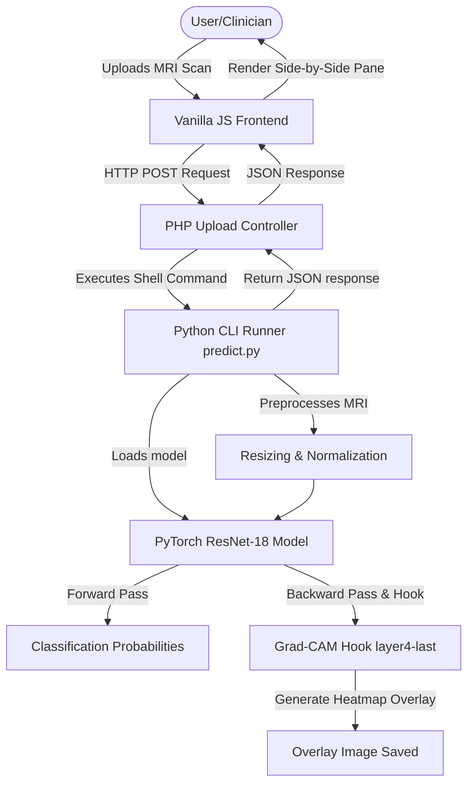

# Final Year Project (FYP) Proposal

## Project Title
**Explainable Clinical Decision Support System for Brain Tumor Classification from MRI Scans using Deep Convolutional Neural Networks and Grad-CAM**

---

## 1. Project Abstract
Early detection and classification of brain tumors are vital for improving patient survival rates and defining optimal treatment pathways. Magnetic Resonance Imaging (MRI) is the gold standard diagnostic technique, but manual analysis is labor-intensive and susceptible to human diagnostic error. Automated Deep Learning models have demonstrated remarkable success in classifying MRI scans; however, their clinical adoption is hindered by a lack of transparency—often referred to as the "black-box" problem. 

This project proposes **NeuroClassify**, a web-based, explainable clinical decision support platform. The system uses a transfer-learning approach with a fine-tuned ResNet-18 Convolutional Neural Network (CNN) to classify T1-weighted contrast-enhanced brain MRIs into four categories: Glioma, Meningioma, Pituitary Tumor, and Normal (No Tumor). To build trust with medical practitioners, we integrate **Gradient-weighted Class Activation Mapping (Grad-CAM)** to visually highlight the pathological regions that motivated the model's classification decision. The tool is wrapped in a high-performance web dashboard developed with HTML5, Vanilla CSS, and JavaScript, backed by a PHP-to-Python integration bridge.

---

## 2. Problem Statement
Diagnostic imaging faces three primary challenges that this project aims to address:
1. **Clinical Workload & Subjectivity**: The volume of MRI scans generated globally outpaces the capacity of trained radiologists. Manual inspection is slow and subject to intra- and inter-observer variability, potentially delaying crucial interventions.
2. **The "Black-Box" Limitation of Medical AI**: Standard deep neural networks output class labels and probabilities without explaining their internal decision path. Clinicians cannot verify if a prediction is based on actual tumor pathology or irrelevant image noise, restricting clinical adoption due to safety and liability concerns.
3. **Integration Barriers**: Advanced Deep Learning models often require complex, heavy server infrastructures (e.g., dedicated Flask/FastAPI servers, Docker containers). There is a clinical need for lightweight, self-contained architectures that can run efficiently on standard local hospital server instances.

---

## 3. Project Objectives
To address these challenges, the project will achieve the following milestones:
- **Objective 1**: Preprocess, normalize, and augment a standard T1-weighted brain MRI dataset to prepare it for high-performance training.
- **Objective 2**: Fine-tune a ResNet-18 CNN architecture using PyTorch to achieve an accuracy of $\ge 90\%$ across 4 distinct classes.
- **Objective 3**: Implement a Grad-CAM explainability pipeline targeting the last convolutional layer to render localized spatial attention heatmaps.
- **Objective 4**: Develop a responsive, user-friendly single-page dashboard allowing clinical uploads, side-by-side raw/heatmap comparisons, classification logs, and reference lookup directories.
- **Objective 5**: Measure system efficacy through standard metrics (Accuracy, Recall, Precision, Confusion Matrices) and qualitative evaluation of attention heatmap alignment against manual radiological markings.

---

## 4. Methodology & Technical Architecture

### 4.1 System Flow & Execution Pipeline
The platform leverages a hybrid stack optimized for simple deployment and rapid execution:

### 4.2 Data Pipeline & Augmentation
Raw MRI scans vary in resolution, brightness, and positioning. The data pipeline standardizes incoming images prior to inference or training:
1. **Resolution Standardization**: All input images are resized to $224 \times 224$ pixels.
2. **Data Augmentation (Training Phase Only)**: To prevent overfitting on smaller sample sets, images undergo random horizontal flips and rotations (up to 15 degrees).
3. **Normalization**: Images are normalized using standard ImageNet distribution statistics:
   $$\mu = [0.485, 0.456, 0.406], \quad \sigma = [0.229, 0.224, 0.225]$$

### 4.3 Deep Learning Model (ResNet-18)
The classification engine uses the **ResNet-18** architecture, which utilizes skip-connections to solve the vanishing gradient problem. The model is initialized with weights pre-trained on ImageNet.
- **Modification**: The final fully connected linear layer is replaced:
  $$f_{\theta}(x) = W_{fc} \cdot x + b$$
  where $W_{fc} \in \mathbb{R}^{4 \times 512}$ maps the 512 output features of the convolutional body to the 4 target tumor classes.
- **Loss Function**: Multi-class Cross-Entropy Loss:
  $$\mathcal{L} = -\frac{1}{N} \sum_{i=1}^{N} \sum_{c=1}^{C} y_{i,c} \log(\hat{y}_{i,c})$$
- **Optimization**: Adam optimizer with a learning rate of $\eta = 0.0001$.

### 4.4 Explainable AI (Grad-CAM)
To verify that the model relies on relevant anatomical features, we extract the spatial activation maps of the final convolutional layer (`layer4[-1]` of ResNet-18) which contains the highest-level spatial abstractions.

1. **Gradient Computation**: Compute the gradient of the score for class $c$ ($y^c$, before softmax) with respect to the activation maps $A^k$ of the convolutional layer.
2. **Global Average Pooling**: Calculate importance weights $\alpha_k^c$ for each channel $k$:
   $$\alpha_k^c = \frac{1}{Z} \sum_{i=1}^{H} \sum_{j=1}^{W} \frac{\partial y^c}{\partial A_{i, j}^k}$$
   where $Z = H \times W$ is the height and width of the activation map.
3. **Weighted Linear Combination & ReLU**:
   $$L_{\text{Grad-CAM}}^c = \text{ReLU}\left(\sum_{k} \alpha_k^c A^k\right)$$
   The Rectified Linear Unit (ReLU) is applied to keep only the features that positively correlate with class $c$.
4. **Overlay Generation**: The resulting heatmap is resized to $224 \times 224$ pixels, colored using the JET color map (red indicating highest activation), and blended with the original grayscale MRI scan:
   $$I_{\text{overlay}} = (1 - \beta) \cdot I_{\text{raw}} + \beta \cdot I_{\text{heatmap}} \quad (\text{where } \beta = 0.4)$$

---

## 5. Development Plan & Project Timeline
The project spans a total of 24 weeks, divided into consecutive execution sprints:

| Phase | Description | Key Deliverables | Timeline (Weeks) |
|---|---|---|---|
| **Phase 1** | Literature Review & Setup | Finalized dataset structure, baseline environment configurations. | Weeks 1 - 4 |
| **Phase 2** | Deep Learning Training | Optimized `train.py`, `best_model.pth`, training curve charts. | Weeks 5 - 8 |
| **Phase 3** | Explainability Engine | Target hooks implementation, Grad-CAM module (`predict.py`). | Weeks 9 - 12 |
| **Phase 4** | Web Dashboard Design | Complete UI layout, side-by-side contrast viewers, localized index pages. | Weeks 13 - 16 |
| **Phase 5** | Integration & Optimization | PHP runtime execution pipeline, multi-format image upload handler. | Weeks 17 - 20 |
| **Phase 6** | Testing & Final Thesis | Performance evaluation metrics, final thesis report, video demo. | Weeks 21 - 24 |

---

## 6. Expected Deliverables & Outcomes
At the completion of the project, the primary outputs will include:
1. **Source Code Repository**: Clean, modular codebase containing training pipelines (`train.py`), prediction and Grad-CAM logic (`predict.py`), PHP upload runner, and Vanilla JS user interface.
2. **Trained Model Weights**: A robust PyTorch model checkpoint file (`best_model.pth`) fine-tuned for high accuracy on brain MRI datasets.
3. **Interactive Dashboard**: A functional clinical support application running on a lightweight local server.
4. **Performance Evaluation Report**: Accuracy/Loss curves, Sensitivity, Specificity, and visual evidence of tumor localization.
5. **Thesis Document**: A comprehensive academic write-up detailing the design, implementation, and clinical findings of the study.

---

## 7. Preliminary References
1. Selvaraju, R. R., Cogswell, M., Das, A., Vedantam, R., Parikh, D., & Batra, D. (2017). **Grad-CAM: Visual Explanations from Deep Networks via Gradient-based Localization**. *IEEE International Conference on Computer Vision (ICCV)*, 618-626.
2. He, K., Zhang, X., Ren, S., & Sun, J. (2016). **Deep Residual Learning for Image Recognition**. *IEEE Conference on Computer Vision and Pattern Recognition (CVPR)*, 770-778.
3. Simonyan, K., & Zisserman, A. (2014). **Very Deep Convolutional Networks for Large-Scale Image Recognition**. *arXiv preprint arXiv:1409.1556*.
4. Cheng, J., et al. (2015). **Retrieval of Brain Tumors by Adaptive Spatial Pooling and Systematic Evaluation on a Large Dataset**. *PLoS ONE*, 10(7).
